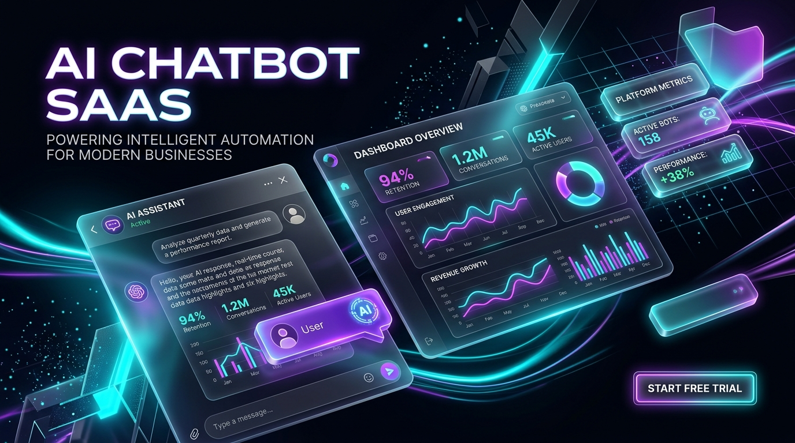
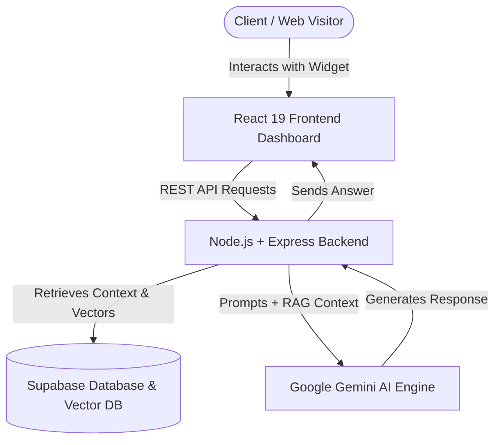

<div align="center">

  

  <br />
  <br />

  <h1>🤖 AI Chatbot SaaS Platform</h1>

  <p>
    <b>An Enterprise-Grade, Multi-Tenant AI Customer Support Platform Powered by Google Gemini & Supabase</b>
  </p>

  <p>
    <a href="https://github.com/IrushaDilshan/ai-chatbot-saas/stargazers"></a>
    <a href="https://github.com/IrushaDilshan/ai-chatbot-saas/network/members"></a>
    <a href="https://github.com/IrushaDilshan/ai-chatbot-saas/issues"></a>
    <a href="https://github.com/IrushaDilshan/ai-chatbot-saas/blob/main/LICENSE"></a>
  </p>

  <p>
    
    
    
    
    
    
  </p>

  <br />

</div>

---

## 🌟 Overview

**AI Chatbot SaaS** is an advanced, production-ready multi-tenant software-as-a-service platform designed for businesses to deploy custom-trained AI customer service agents in seconds. 

By leveraging **Google Gemini AI** alongside **Supabase** for RAG (Retrieval-Augmented Generation) and vector search, this platform turns company knowledge documents (PDFs, guides, FAQs) into instant, accurate, 24/7 intelligent conversational agents.

---

## ✨ Key Features

- 🏢 **Multi-Tenant SaaS Architecture**: Manage companies, workspaces, client API keys, and isolated organization environments.
- 📚 **Knowledge Base & Document RAG**: Upload PDF documents, ingest context, and perform semantic search for precise AI answers.
- 💬 **Embeddable Chatbot Widget**: Clean, lightweight, customizable widget script ready to drop into any external website or app.
- ⚡ **Real-Time Playground & Testing**: Integrated live chat sandbox inside the dashboard to preview and fine-tune bot responses.
- 🎨 **Branding & Customization**: Customize widget themes, primary colors, welcome greeting messages, and bot avatars.
- 📊 **Analytics & Metrics**: Monitor active conversations, total messages served, knowledge base utilization, and engagement metrics.
- 🔐 **Secure Authentication**: Built-in authentication powered by Supabase Auth and token verification middleware.

---

## 🏗️ Architecture & Tech Stack



### 💻 Stack Breakdown

| Layer | Technologies |
| :--- | :--- |
| **Frontend** | React 19, Vite, Tailwind CSS v4, Lucide React Icons, Axios, React Router v7 |
| **Backend API** | Node.js, Express.js, CORS, Multer, `pdf-parse` |
| **AI Integration** | `@google/genai`, `@google/generative-ai` (Gemini Flash / Pro) |
| **Database & Auth** | Supabase JS Client (PostgreSQL, Vector Storage, Supabase Auth) |

---

## 📁 Repository Structure

```
ai-chatbot-saas/
├── 📁 assets/                 # Readme media & assets
│   └── 🖼️ banner.jpg
├── 📁 client/                 # React 19 Frontend Application
│   ├── 📁 src/
│   │   ├── 📁 components/     # UI Components & Embeddable Chat Widget
│   │   ├── 📁 context/        # React Auth & State Contexts
│   │   ├── 📁 pages/          # Dashboard, Knowledge Base, Client Management, Login
│   │   ├── 📄 App.jsx
│   │   └── 📄 main.jsx
│   ├── 📄 vite.config.js
│   └── 📄 package.json
├── 📁 src/                    # Node.js + Express Backend API
│   ├── 📁 config/             # Supabase & Gemini configurations
│   ├── 📁 controllers/        # Route controllers (Chat, Knowledge, Client, Company)
│   ├── 📁 middleware/         # Auth & validation middleware
│   ├── 📁 routes/             # API routes definitions
│   ├── 📁 services/           # PDF parsing, RAG embedding, Gemini services
│   ├── 📄 app.js
│   └── 📄 server.js
├── 📄 package.json
└── 📄 README.md
```

---

## 🚀 Quick Start Guide

### Prerequisites

Ensure you have the following installed on your machine:
- [Node.js](https://nodejs.org/) (v18 or higher recommended)
- [npm](https://www.npmjs.com/) or [yarn](https://yarnpkg.com/)
- A [Supabase](https://supabase.com/) project
- A [Google Gemini API Key](https://aistudio.google.com/)

---

### 1. Clone the Repository

```bash
git clone https://github.com/IrushaDilshan/ai-chatbot-saas.git
cd ai-chatbot-saas
```

---

### 2. Configure Environment Variables

#### Backend `.env` (in root directory)
Create a `.env` file in the project root:

```env
PORT=5000
GEMINI_API_KEY=your_google_gemini_api_key
SUPABASE_URL=your_supabase_project_url
SUPABASE_ANON_KEY=your_supabase_anon_key
SUPABASE_SERVICE_ROLE_KEY=your_supabase_service_role_key
```

#### Frontend `.env` (in `client/` directory)
Create a `.env` file inside `client/`:

```env
VITE_API_URL=http://localhost:5000
VITE_SUPABASE_URL=your_supabase_project_url
VITE_SUPABASE_ANON_KEY=your_supabase_anon_key
```

---

### 3. Install Dependencies

#### Install Backend Dependencies:
```bash
npm install
```

#### Install Frontend Dependencies:
```bash
cd client
npm install
cd ..
```

---

### 4. Run the Application

#### Start the Express Backend Server:
```bash
npm start
```
*The server will start running on `http://localhost:5000`.*

#### Start the React Frontend Development Server:
```bash
cd client
npm run dev
```
*The frontend dashboard will be available at `http://localhost:5173`.*

---

## 🔌 API Endpoints Summary

| Method | Endpoint | Description |
| :--- | :--- | :--- |
| `POST` | `/api/chat` | Send prompt to AI agent and retrieve RAG augmented response |
| `POST` | `/api/knowledge/upload` | Upload PDF documents to ingest into RAG Knowledge Base |
| `GET` | `/api/knowledge` | List knowledge items and documents for organization |
| `POST` | `/api/company` | Register / update company profile & branding options |
| `POST` | `/api/client/keys` | Generate & manage client API keys for widget deployment |

---

## 🤝 Contributing

Contributions, issues, and feature requests are welcome!  
Feel free to check the [issues page](https://github.com/IrushaDilshan/ai-chatbot-saas/issues).

1. Fork the Project
2. Create your Feature Branch (`git checkout -b feature/AmazingFeature`)
3. Commit your Changes (`git commit -m 'Add some AmazingFeature'`)
4. Push to the Branch (`git push origin feature/AmazingFeature`)
5. Open a Pull Request

---

## 📜 License

Distributed under the MIT License. See [`LICENSE`](LICENSE) for more information.

<div align="center">
  <sub>Built with ❤️ by <a href="https://github.com/IrushaDilshan">Irusha Dilshan</a></sub>
</div>
